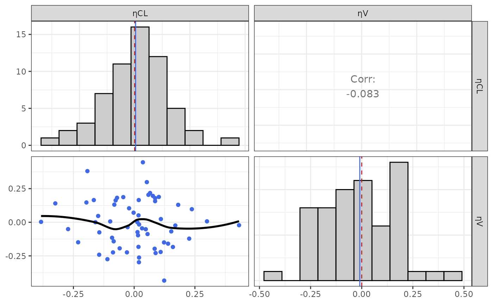

# Covariate Analysis

``` r
library(nonmem.utils)
```

## Preamble

Covariate analysis in PopPK modeling is a critical step used to identify
and quantify factors that explain variability in PK parameters across
individuals in a population.

To perform such analysis, Nonmem result file (e.g. `.tab` or `.par`
file) must include `ETA` variable(s).

Such variables are defined in the meta data dictionary as `Type`: `eta`
as illustrated below:

| Name | Type | Label | Unit |
|------|------|-------|------|
| ETA1 | eta  | ηCL   |      |
| ETA2 | eta  | ηV    |      |

## Interactive analysis

To analyse interactively Nonmem results you can use the shiny app below:

``` r
nonmem.utils::run_shiny("covariate-analysis")
```

## Quarto Report

To create a docx report of the covariate analysis you can use the quarto
based function below:

``` r
nonmem.utils::report_covariate_analysis(
data_path = "my/dataset.tab", 
meta_data_path = "my/dictionary.csv"
)
```

## Available analyses

### Etas distribution and correlation

To analyze etas distributions and potential correlations, the function
[`eta_plot()`](https://pchelle.github.io/nonmem.utils/reference/eta_plot.md)
can be used.

``` r
eta_plot(data_501, meta_data_501)
#> $All
```



    #> 
    #> $SEX


### Covariates vs etas

To analyze potential correlations between etas and covariates, 2
functions can be used:
[`eta_cov_plot()`](https://pchelle.github.io/nonmem.utils/reference/eta_cov_plot.md)
and
[`eta_cor()`](https://pchelle.github.io/nonmem.utils/reference/eta_cor.md).

The function
[`eta_cov_plot()`](https://pchelle.github.io/nonmem.utils/reference/eta_cov_plot.md)
allows graphical analyses of the covariate distribution and correlation:

``` r
eta_cov_plot(data_501, meta_data_501)
#> $All
```


    #> 
    #> $SEX


The function
[`eta_cor()`](https://pchelle.github.io/nonmem.utils/reference/eta_cor.md)
provides a table with

- Spearman correlation test results between continuous covariates and
  etas
- ANOVA test results between categorical covariates and etas

``` r
eta_table <- eta_cor(data_501, meta_data_501)
eta_table |>
  highlight_significant() |>
  knitr::kable()
```

[TABLE]
