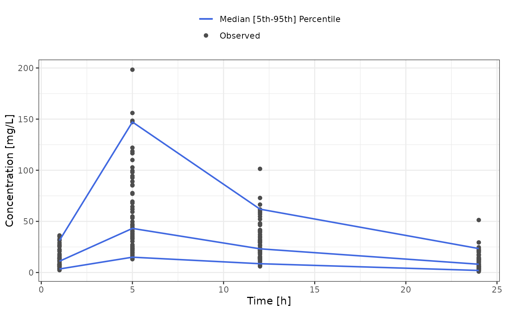
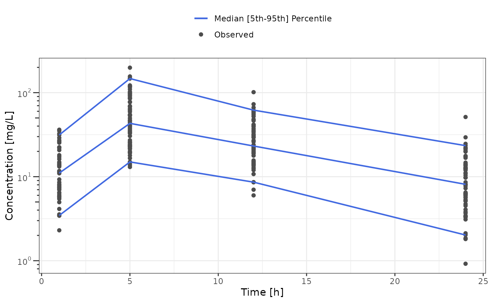
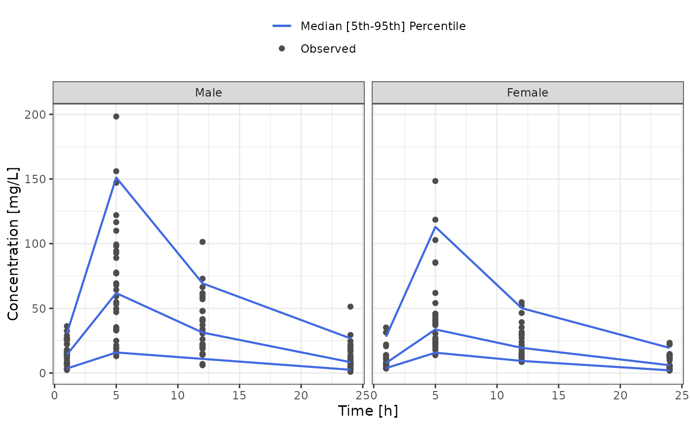
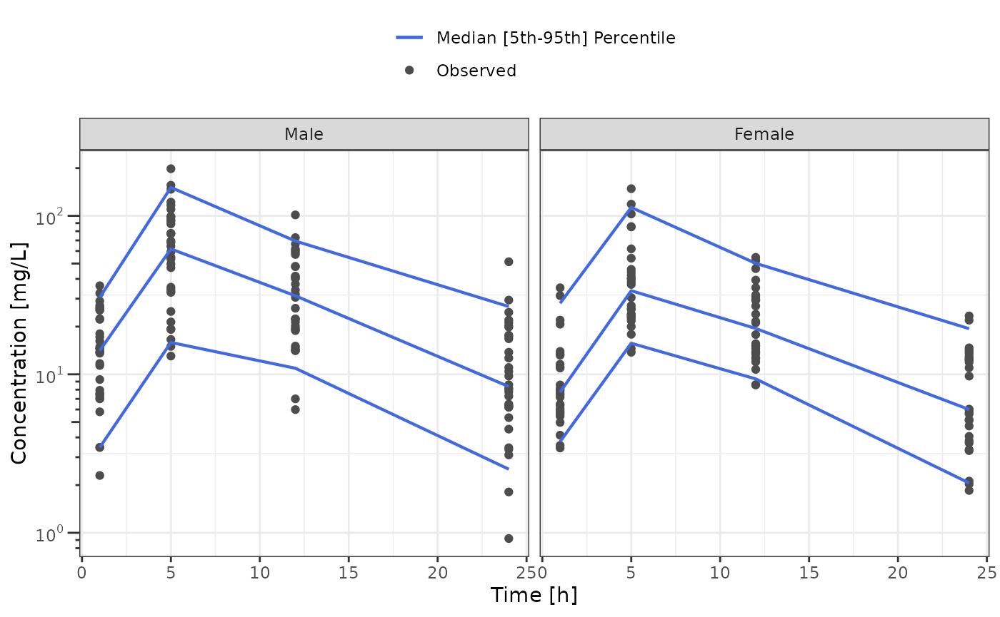
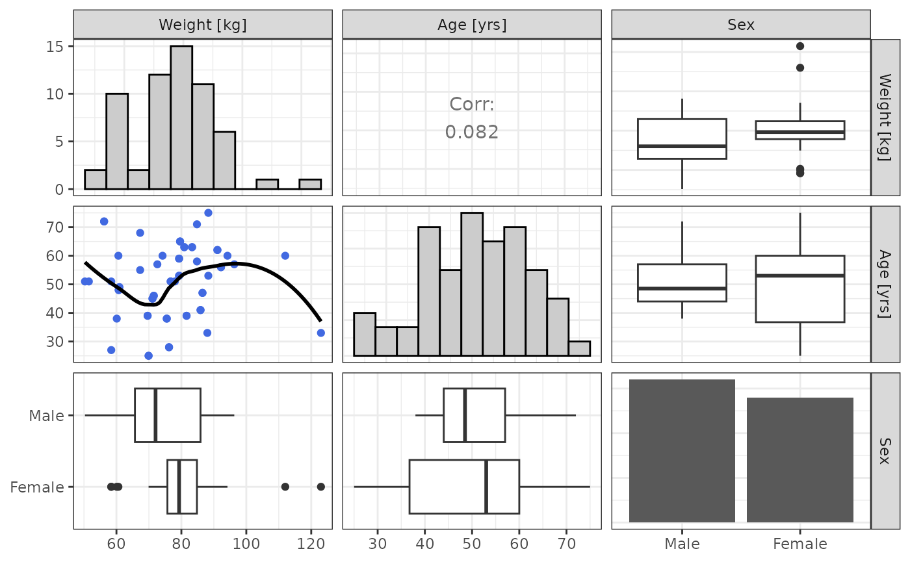

# Dataset Analysis

``` r
library(nonmem.utils)
```

## Interactive analysis

To analyse interactively a dataset you can use the shiny app below:

    nonmem.utils::run_shiny("dataset-analysis")

## Quarto Report

To create a docx report of the dataset analysis you can use the quarto
based function below:

    nonmem.utils::report_dataset_analysis(
    data_path = "my/dataset.csv", 
    meta_data_path = "my/dictionary.csv"
    )

## Available analyses

### Inventories

This section regroup 3 functions that aim at summarizing the available
PK data:
[`data_inventory()`](https://pchelle.github.io/nonmem.utils/reference/data_inventory.md),
[`cov_inventory()`](https://pchelle.github.io/nonmem.utils/reference/cov_inventory.md)
and
[`cat_inventory()`](https://pchelle.github.io/nonmem.utils/reference/cat_inventory.md)

Data inventory mainly provides number PK studies (or occasions),
patients, measurements and doses.

The data inventory output is a named list of tables, including `"All"`
for the summary table that use all the data. When `cat` variables are
defined in the meta_data, the variable labels (`"Sex"` in the example
below) are added to the list of tables.

``` r
pk_summary <- data_inventory(data_501, meta_data_501)
```

You can also format the inventory to print them all in the same table

``` r
pk_summary <- cbind(pk_summary$Sex, All = pk_summary$All[["All"]])
knitr::kable(pk_summary)
```

| Sex                      | Male | Female | All |
|:-------------------------|-----:|-------:|----:|
| Subjects                 |   32 |     28 |  60 |
| Studies                  |   32 |     28 |  60 |
| Doses                    |   32 |     28 |  60 |
| Observations             |  128 |    112 | 240 |
| Studies per Subject      |    1 |      1 |   1 |
| Doses per Subject        |    1 |      1 |   1 |
| Doses per Study          |    1 |      1 |   1 |
| Observations per Subject |    4 |      4 |   4 |
| Observations per Study   |    4 |      4 |   4 |

Continuous covariate inventory provides summary statistics of the
continuous covariates of the dataset.

The covariate inventory output is a named list of tables, including
`"All"` for the summary table that use all the data. When `cat`
variables are defined in the meta_data, the variable labels (`"Sex"` in
the example below) are added to the list of tables.

``` r
pk_summary <- cov_inventory(data_501, meta_data_501)
```

Here is an example printing all the tables below each other:

``` r
for (summary_label in names(pk_summary)) {
  cat(summary_label)
  cat("\n\n")
  cat(knitr::kable(pk_summary[[summary_label]]), sep = "\n")
  cat("\n\n")
}
```

SEX : Male

| Statistics | Weight \[kg\] | Age \[yrs\] |
|:-----------|--------------:|------------:|
| N          |         32.00 |       32.00 |
| Mean       |         74.15 |       50.91 |
| Median     |         72.05 |       48.50 |
| SD         |         12.84 |       10.05 |
| Min        |         50.30 |       38.00 |
| Max        |         96.30 |       72.00 |

SEX : Female

| Statistics | Weight \[kg\] | Age \[yrs\] |
|:-----------|--------------:|------------:|
| N          |         28.00 |       28.00 |
| Mean       |         80.06 |       50.64 |
| Median     |         79.30 |       53.00 |
| SD         |         14.07 |       14.87 |
| Min        |         58.40 |       25.00 |
| Max        |        123.00 |       75.00 |

All

| Statistics | Weight \[kg\] | Age \[yrs\] |
|:-----------|--------------:|------------:|
| N          |         60.00 |       60.00 |
| Mean       |         76.91 |       50.78 |
| Median     |         77.35 |       51.00 |
| SD         |         13.64 |       12.42 |
| Min        |         50.30 |       25.00 |
| Max        |        123.00 |       75.00 |

Categorical covariate inventory provides count and percent summary the
categorical covariates of the dataset.

The categorical covariate inventory output a table

``` r
pk_summary <- cat_inventory(data_501, meta_data_501)
knitr::kable(pk_summary)
```

| Sex    | Count |  Percent |
|:-------|------:|---------:|
| Male   |    32 | 53.33333 |
| Female |    28 | 46.66667 |

### Time profiles

The
[`time_profile()`](https://pchelle.github.io/nonmem.utils/reference/time_profile.md)
and
[`tad_profile()`](https://pchelle.github.io/nonmem.utils/reference/tad_profile.md)
functions respectively plot the `dv` as a function of `time` and `tad`,
along with median, 5th and 95th percentile profiles.

Both functions include the `bins` argument that allows to define the
number of bins for the median, 5th, 95th profiles.

Both functions output a named list of plots, including `"All"` for plots
that use all the data. When `cat` variables are defined in the
meta_data, the variable names (`"SEX"` in the example below) are added
to the list of plots. The corresponding plots will facet the time
profiles by the cat variable labels.

Each element of the list include a second named list: `"Linear"`,
`"Log"` and `"Percent BLQ"` that will display the time profiles in
linear scale, logarithmic scale or percent of BLQ values present in each
bin.

``` r
tp_plots <- time_profile(data_501, meta_data_501)
#> Warning in geom_rug(data = filter(data, .data[[variable_names$blq]] > 0), :
#> Ignoring unknown aesthetics: text
#> Warning in geom_point(mapping = aes(y = .data[[variable_names$dv]], text =
#> tooltip_text(.data, : Ignoring unknown aesthetics: text
#> Warning in geom_line(data = vpc_data, mapping = aes(x = .data[["x"]], y =
#> .data[["ymin"]], : Ignoring unknown aesthetics: text
#> Warning in geom_line(data = vpc_data, mapping = aes(x = .data[["x"]], y =
#> .data[["ymax"]], : Ignoring unknown aesthetics: text
#> Warning in geom_line(data = vpc_data, mapping = aes(x = .data[["x"]], y =
#> .data[["y"]], : Ignoring unknown aesthetics: text
#> Warning in geom_rug(data = filter(data, .data[[variable_names$blq]] > 0), :
#> Ignoring unknown aesthetics: text
#> Warning in geom_point(mapping = aes(y = .data[[variable_names$dv]], text =
#> tooltip_text(.data, : Ignoring unknown aesthetics: text
#> Warning in geom_line(data = vpc_data, mapping = aes(x = .data[["x"]], y =
#> .data[["ymin"]], : Ignoring unknown aesthetics: text
#> Warning in geom_line(data = vpc_data, mapping = aes(x = .data[["x"]], y =
#> .data[["ymax"]], : Ignoring unknown aesthetics: text
#> Warning in geom_line(data = vpc_data, mapping = aes(x = .data[["x"]], y =
#> .data[["y"]], : Ignoring unknown aesthetics: text
```

- Displaying time profiles in linear scale

``` r
tp_plots$All$Linear
```



- Displaying time profiles in log scale scale

``` r
tp_plots$All$Log
```



- Displaying time profiles by `"SEX"` in linear scale

``` r
tp_plots$SEX$Linear
```



- Displaying time profiles by `"SEX"` in log scale

``` r
tp_plots$SEX$Log
```



### Covariates distribution and correlation

To analyze covariate distributions and potential correlations, 2
functions can be used:
[`cov_plot()`](https://pchelle.github.io/nonmem.utils/reference/cov_plot.md)
and
[`cov_cor()`](https://pchelle.github.io/nonmem.utils/reference/cov_cor.md).

The function
[`cov_plot()`](https://pchelle.github.io/nonmem.utils/reference/cov_plot.md)
allows graphical analyses of the covariate distribution and correlation:

``` r
cov_plot(data_501, meta_data_501)
```



The function
[`cov_cor()`](https://pchelle.github.io/nonmem.utils/reference/cov_cor.md)
provides a table with

- Spearman correlation test results between continuous covariates
- ANOVA test results between continuous and categorical covariates

``` r
cov_table <- cov_cor(data_501, meta_data_501)
cov_table |>
  highlight_significant() |>
  knitr::kable()
```

[TABLE]
