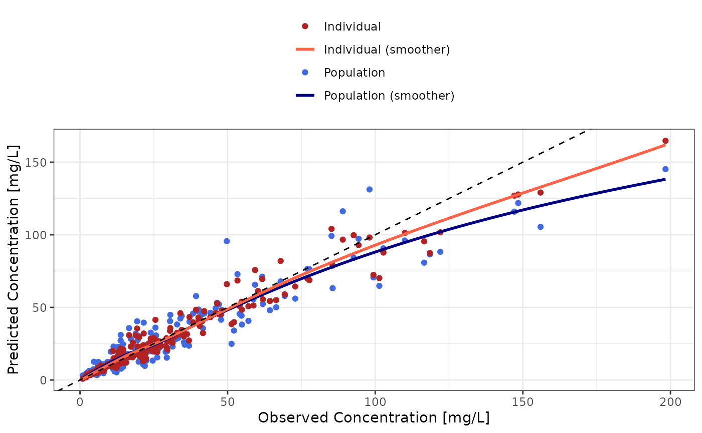
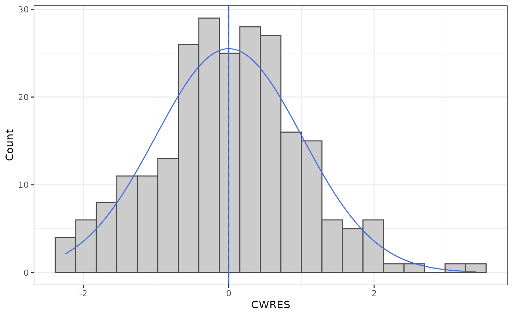
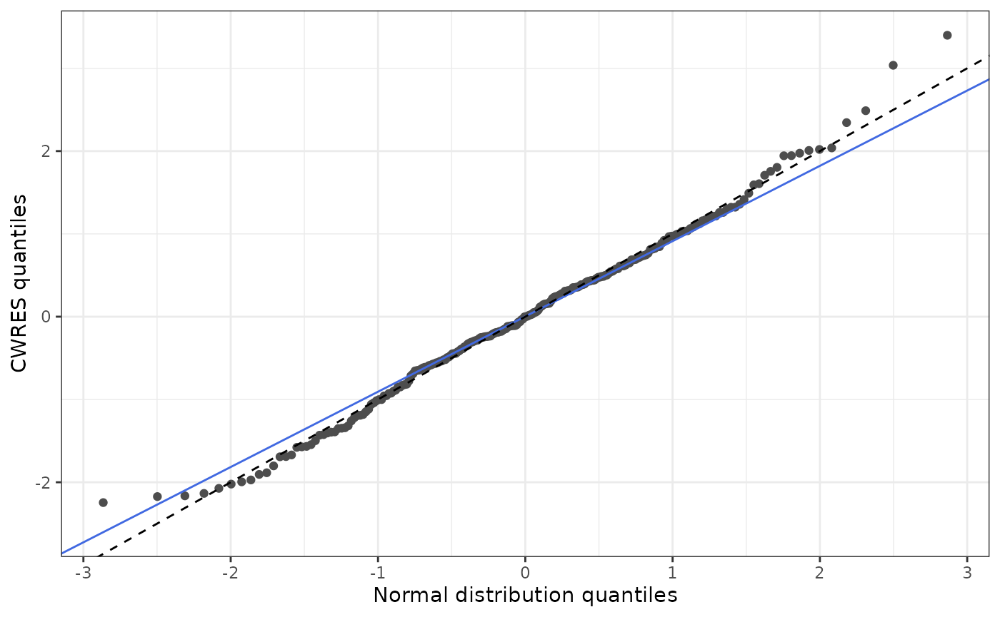
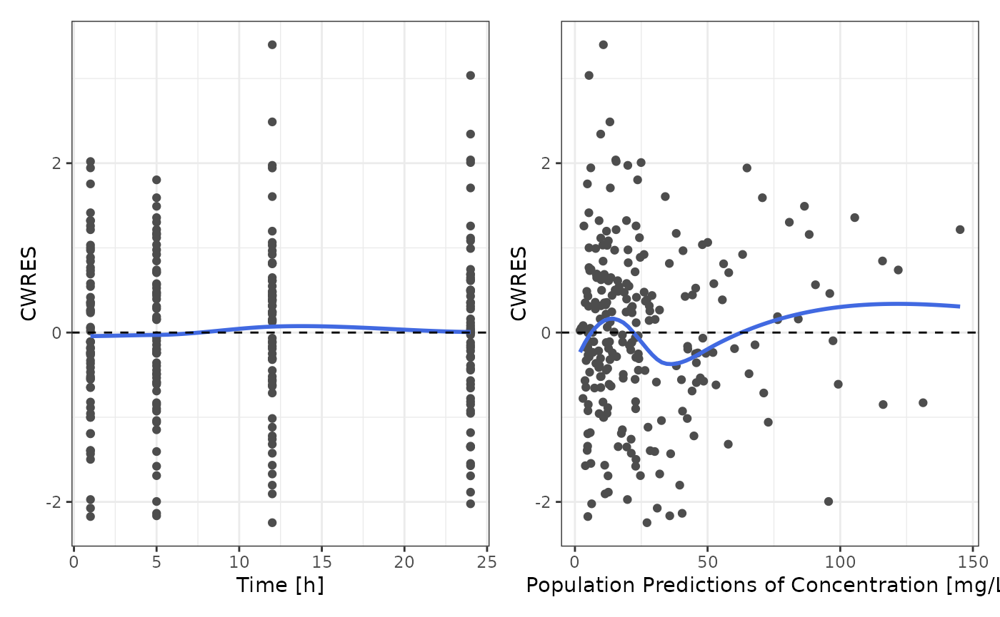
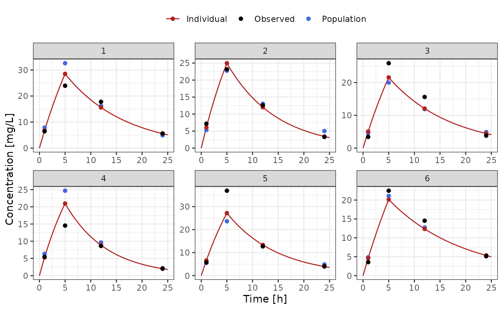
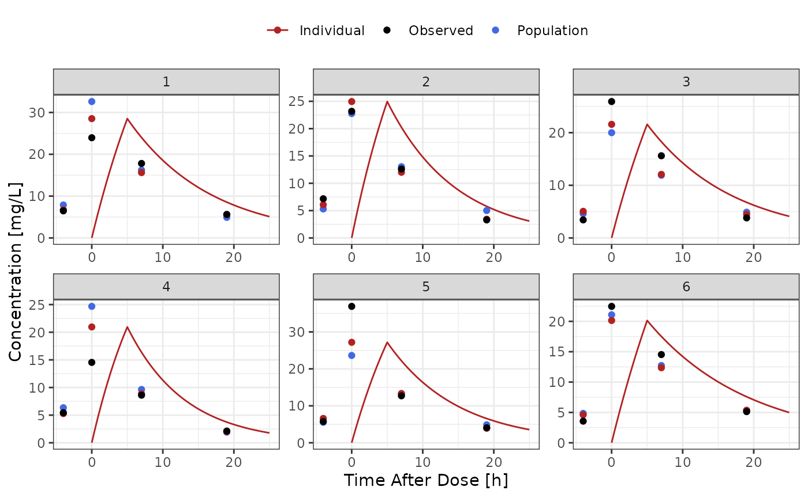

# GOF Analysis

``` r
library(nonmem.utils)
```

## Preamble

Goodness-of-fit (GOF) analysis is a key diagnostic tool used to evaluate
how well a PopPK model describes the observed data. It helps determine
whether the model is appropriate, reliable, and suitable for prediction

To perform such analysis, Nonmem result file (e.g. `.tab` file) must
include usual Nonmem variables such as `PRED`, `IPRED`, `CWRES` and
`NPDE`.

Such variables do not need to defined in the meta data dictionary as
`PRED` and `IPRED` will use the `dv` type for labelling.

## Interactive analysis

To analyse interactively Nonmem results you can use the shiny app below:

    nonmem.utils::run_shiny("gof-analysis")

## Quarto Report

To create a docx report of the GOF analysis you can use the quarto based
function below:

    nonmem.utils::report_gof_analysis(
    data_path = "my/dataset.tab", 
    meta_data_path = "my/dictionary.csv"
    )

## Available analyses

### Observed vs predicted

The function
[`dv_preds()`](https://pchelle.github.io/nonmem.utils/reference/dv_preds.md)
plots observed vs individual and population predictions in both linear
and log scales.

``` r
dv_preds(data_501, meta_data_501)
#> Warning in geom_rug(data = dplyr::filter(fill_nonmem_vars(data),
#> .data[[variable_names$mdv]] == : Ignoring unknown aesthetics:
#> text
#> Warning in geom_point(mapping = aes(y = PRED, text = tooltip_text(.data, :
#> Ignoring unknown aesthetics: text
#> Warning in geom_point(mapping = aes(y = IPRED, text = tooltip_text(.data, :
#> Ignoring unknown aesthetics: text
```



To obtain the plot in log-log scale, the function
[`gg_log()`](https://pchelle.github.io/nonmem.utils/reference/gg_log.md)
can be used as illustrated below:

``` r
dv_preds(data_501, meta_data_501) |>
  gg_log()
#> Warning in geom_rug(data = dplyr::filter(fill_nonmem_vars(data),
#> .data[[variable_names$mdv]] == : Ignoring unknown aesthetics:
#> text
#> Warning in geom_point(mapping = aes(y = PRED, text = tooltip_text(.data, :
#> Ignoring unknown aesthetics: text
#> Warning in geom_point(mapping = aes(y = IPRED, text = tooltip_text(.data, :
#> Ignoring unknown aesthetics: text
```


### Residuals

To assess residual distributions, 3 functions are available:
[`residual_hist()`](https://pchelle.github.io/nonmem.utils/reference/residual_hist.md),
[`residual_qq()`](https://pchelle.github.io/nonmem.utils/reference/residual_qq.md)
and
[`residual_plot()`](https://pchelle.github.io/nonmem.utils/reference/residual_plot.md).

- The function
  [`residual_hist()`](https://pchelle.github.io/nonmem.utils/reference/residual_hist.md)
  plots histogram of residuals

``` r
residual_hist(y_type = "cwres", data = data_501, meta_data = meta_data_501)
```



- The function
  [`residual_qq()`](https://pchelle.github.io/nonmem.utils/reference/residual_qq.md)
  perform QQ-plots of residuals

``` r
residual_qq(y_type = "cwres", data = data_501, meta_data = meta_data_501)
```



- The function
  [`residual_plot()`](https://pchelle.github.io/nonmem.utils/reference/residual_plot.md)
  plots residuals vs another variable to analyze potential trends

``` r
patchwork::wrap_plots(
  residual_plot(x_type = "time", y_type = "cwres", data = data_501, meta_data = meta_data_501),
  residual_plot(x_type = "pred", y_type = "cwres", data = data_501, meta_data = meta_data_501)
)
#> Warning in simpleLoess(y, x, w, span, degree = degree, parametric = parametric,
#> : pseudoinverse used at 0.885
#> Warning in simpleLoess(y, x, w, span, degree = degree, parametric = parametric,
#> : neighborhood radius 11.115
#> Warning in simpleLoess(y, x, w, span, degree = degree, parametric = parametric,
#> : reciprocal condition number 8.2288e-17
#> Warning in simpleLoess(y, x, w, span, degree = degree, parametric = parametric,
#> : There are other near singularities as well. 365.38
#> Warning: The following aesthetics were dropped during statistical transformation: text.
#> ℹ This can happen when ggplot fails to infer the correct grouping structure in
#>   the data.
#> ℹ Did you forget to specify a `group` aesthetic or to convert a numerical
#>   variable into a factor?
#> The following aesthetics were dropped during statistical transformation: text.
#> ℹ This can happen when ggplot fails to infer the correct grouping structure in
#>   the data.
#> ℹ Did you forget to specify a `group` aesthetic or to convert a numerical
#>   variable into a factor?
```



### Individual time profiles

To review individual time profiles, the functions
[`ind_time_profiles()`](https://pchelle.github.io/nonmem.utils/reference/ind_time_profiles.md)
and
[`ind_tad_profiles()`](https://pchelle.github.io/nonmem.utils/reference/ind_tad_profiles.md)
can be used as illustrated below. The functions leverage simple 1-, 2-,
and 3-compartment models using the `mrgsolve` package and PK parameters
Nonmem naming convention (e.g. if dataset includes only `CL` and `V`,
the code assumes a 1-compartment model).

``` r
ind_time_profiles(
  data = data_501 |> dplyr::filter(ID <= 6),
  meta_data = meta_data_501
)
#> Warning in geom_rug(data = dplyr::filter(tp_data, .data[[variable_names$blq]] >
#> : Ignoring unknown aesthetics: text
#> Warning in geom_line(data = filter(sim_data, ID %in% selected_ids), mapping =
#> aes(x = TIME, : Ignoring unknown aesthetics: text
#> Warning in geom_point(mapping = aes(y = PRED, text = tooltip_text(.data, :
#> Ignoring unknown aesthetics: text
#> Warning in geom_point(mapping = aes(y = IPRED, text = tooltip_text(.data, :
#> Ignoring unknown aesthetics: text
#> Warning in geom_point(mapping = aes(y = .data[[variable_names$dv]], text =
#> tooltip_text(.data, : Ignoring unknown aesthetics: text
#> [[1]]
```



``` r
ind_tad_profiles(
  data = data_501 |> dplyr::filter(ID <= 6),
  meta_data = meta_data_501
)
#> Warning in geom_rug(data = dplyr::filter(tp_data, .data[[variable_names$blq]] >
#> : Ignoring unknown aesthetics: text
#> Warning in geom_line(data = filter(sim_data, ID %in% selected_ids), mapping =
#> aes(x = tad, : Ignoring unknown aesthetics: text
#> Warning in geom_point(mapping = aes(y = PRED, text = tooltip_text(.data, :
#> Ignoring unknown aesthetics: text
#> Warning in geom_point(mapping = aes(y = IPRED, text = tooltip_text(.data, :
#> Ignoring unknown aesthetics: text
#> Warning in geom_point(mapping = aes(y = .data[[variable_names$dv]], text =
#> tooltip_text(.data, : Ignoring unknown aesthetics: text
#> [[1]]
```


