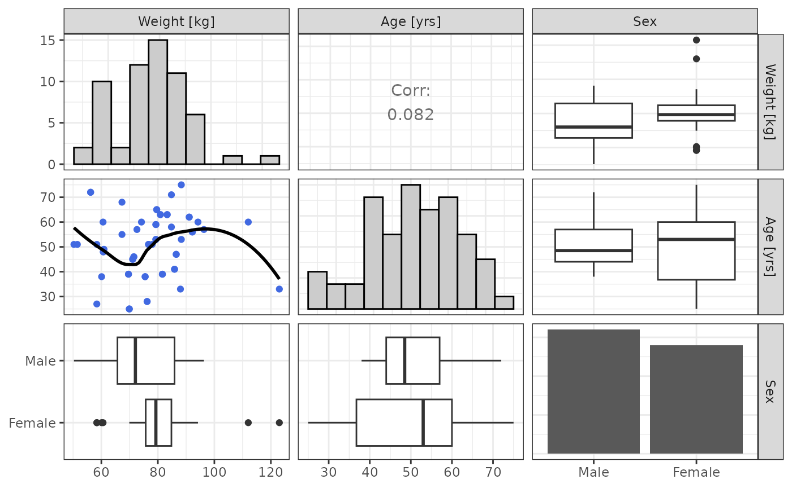

# Get Started

``` r
library(nonmem.utils)
```

## Concept

This package aims at providing helpers for reporting PopPK modeling as
performed using Nonmem.

`nonmem.utils` concept is to leverage a dictionary data.frame
(`meta_data` argument) to provide a mapping between the data (`data`
argument) variables and their information such as labels and units.

### `data`

The `data` argument is a data.frame that contains the data to be
analyzed.

To illustrate the package features, dataset 501 from [NONMEM
Tutorial](https://doi.org/10.1002/psp4.12404) is exposed as shown below:

``` r
data_501 |>
  head() |>
  knitr::kable()
```

|  ID | OCC | TIME | TAD |    DV | EVID | MDV |  AMT | RATE |   WT | AGE | SEX |      PRED |        RES |      CWRES |     IPRED |       IRES |      IWRES |       NPDE |       CL |        V |      ETA1 |       ETA2 |
|----:|----:|-----:|----:|------:|-----:|----:|-----:|-----:|-----:|----:|----:|----------:|-----------:|-----------:|----------:|-----------:|-----------:|-----------:|---------:|---------:|----------:|-----------:|
|   1 |   1 |    0 |  -5 |  0.00 |    1 |   1 | 1000 |  200 | 58.4 |  51 |   1 |  0.000000 |  0.0000000 |  0.0000000 |  0.000000 |  0.0000000 |  0.0000000 |  0.0000000 | 2.451403 | 28.49479 | 0.0188326 |  0.1651707 |
|   1 |   1 |    1 |  -4 |  6.47 |    0 |   0 |    0 |    0 | 58.4 |  51 |   1 |  7.880463 | -1.4104630 | -0.3640174 |  6.725388 | -0.2553884 | -0.1693880 | -0.3640174 | 2.451403 | 28.49479 | 0.0188326 |  0.1651707 |
|   1 |   1 |    5 |   0 | 23.96 |    0 |   0 |    0 |    0 | 58.4 |  51 |   1 | 32.607640 | -8.6476430 | -1.0393830 | 28.521470 | -4.5614710 | -0.7133978 | -1.0393830 | 2.451403 | 28.49479 | 0.0188326 |  0.1651707 |
|   1 |   1 |   12 |   7 | 17.81 |    0 |   0 |    0 |    0 | 58.4 |  51 |   1 | 16.239350 |  1.5706550 |  0.4863708 | 15.618370 |  2.1916250 |  0.6259351 |  0.4863708 | 2.451403 | 28.49479 | 0.0188326 |  0.1651707 |
|   1 |   1 |   24 |  19 |  5.63 |    0 |   0 |    0 |    0 | 58.4 |  51 |   1 |  4.915492 |  0.7145082 | -0.0019791 |  5.562734 |  0.0672664 |  0.0539397 | -0.0019791 | 2.451403 | 28.49479 | 0.0188326 |  0.1651707 |
|   2 |   1 |    0 |  -5 |  0.00 |    1 |   1 | 1000 |  200 | 79.3 |  53 |   1 |  0.000000 |  0.0000000 |  0.0000000 |  0.000000 |  0.0000000 |  0.0000000 |  0.0000000 | 3.261006 | 31.21143 | 0.1229087 | -0.1500610 |

### `meta_data`

The `meta_data` argument is a dictionary data.frame that contains the
information about the dataset.

It should contain the following columns:

- **`Name`**: name of the dataset variable
- **`Type`**: type of the dataset variables in lower cases.
  - The type can be one of the following: `id`, `occ`, `time`, `tad`,
    `dv`, `amt`, `evid`, `mdv`.
  - If the variable is a continuous covariate, use `cov`.
  - If the variable is a categorical covariate, use `cat`.
  - If the variable is a model BSV/BOV parameters, use `eta`.
- **`Label`**: displayed label of the dataset variable
- **`Unit`**: displayed unit of the dataset variable
  - For categorical covariates (Type is `cat`), see explanations and
    example below.
- **`Min`**: the minimum expected value of the dataset variable
- **`Max`**: the maximum expected value of the dataset variable

Mapping between the categorical covariate values and labels can be
provided in the **`Label`** column. The `jsonlite` package is leveraged
to parse the mapping. As a consequence, the mapping is expected to be
provided as **`"value":"label"`** split by pipes `|`.

For instance, to map a variable named `sex` with `0` coding for *male*
and `1` coding for *female*, the Label cell should be have the following
value:

``` json
"0":"male"|"1":"female"
```

💡 *Defining multiple dictionaries can be useful if many covariates are
available*

To illustrate the package features, a dictionary for dataset 501 from
[NONMEM Tutorial](https://doi.org/10.1002/psp4.12404) is exposed as
shown below:

``` r
meta_data_501 |>
  knitr::kable()
```

| Name | Type  | Label                      | Unit                     | Min | Max |
|:-----|:------|:---------------------------|:-------------------------|:----|:----|
| ID   | id    | Subject                    | NA                       | NA  | NA  |
| OCC  | occ   | Occasion                   | NA                       | NA  | NA  |
| TIME | time  | Time                       | h                        | NA  | NA  |
| TAD  | tad   | Time After Dose            | h                        | NA  | NA  |
| DV   | dv    | Concentration              | mg/L                     | NA  | NA  |
| EVID | evid  | Event Identifier           | NA                       | NA  | NA  |
| MDV  | mdv   | Missing Dependent Variable | NA                       | NA  | NA  |
| AMT  | amt   | Amount                     | mg                       | NA  | NA  |
| RATE | rate  | Rate                       | mg/h                     | NA  | NA  |
| WT   | cov   | Weight                     | kg                       | NA  | NA  |
| AGE  | cov   | Age                        | yrs                      | NA  | NA  |
| SEX  | cat   | Sex                        | “0”:“Male”\|“1”:“Female” | NA  | NA  |
| CL   | param | Clearance                  | L/h                      | NA  | NA  |
| V    | param | Volume                     | L                        | NA  | NA  |
| ETA1 | eta   | Clearance                  | NA                       | NA  | NA  |
| ETA2 | eta   | Volume                     | NA                       | NA  | NA  |

## Example

Once `data` and `meta_data` are defined, they can be used to populate
graphical and tabular results for PopPK analyses as illustrated below:

For instance

``` r
cov_cor(data_501, meta_data_501) |>
  knitr::kable()
```

[TABLE]

``` r
cov_plot(data_501, meta_data_501)
```



## Available Analyses

Dedicated articles show how to use `nonmem.utils` functions to support :

- [Dataset Analysis and
  Summary](https://pchelle.github.io/nonmem.utils/articles/dataset-analysis.md)
- [Covariate
  Analysis](https://pchelle.github.io/nonmem.utils/articles/covariate-analysis.md)
- [Goodness of Fit
  Analysis](https://pchelle.github.io/nonmem.utils/articles/gof-analysis.md)

## Shiny

Run the following code to open the toolbox (also available in the
RStudio Addins menu):

``` r
nonmem.utils::shiny_toolbox()
```

Select the desired tool from the toolbox (for instance,
covariate-analysis) and click on the button Done.

The appropriate code will be added to the R console to start the
corresponding tool.

## Reporting

The package offers support functions to format analysis tables to
`html`, `pdf` (using `typst`) and `docx`.

To get a default `docx` or `pdf` report of your analysis, you can use
functions such as below:

``` r
nonmem.utils::report_dataset_analysis(data_path, meta_data_path)
```
