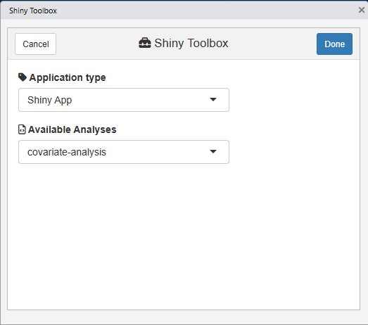
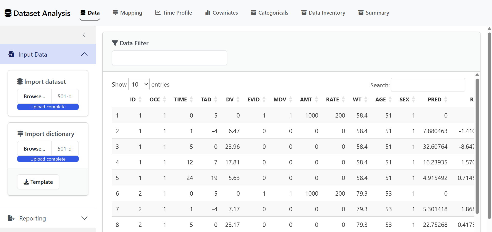
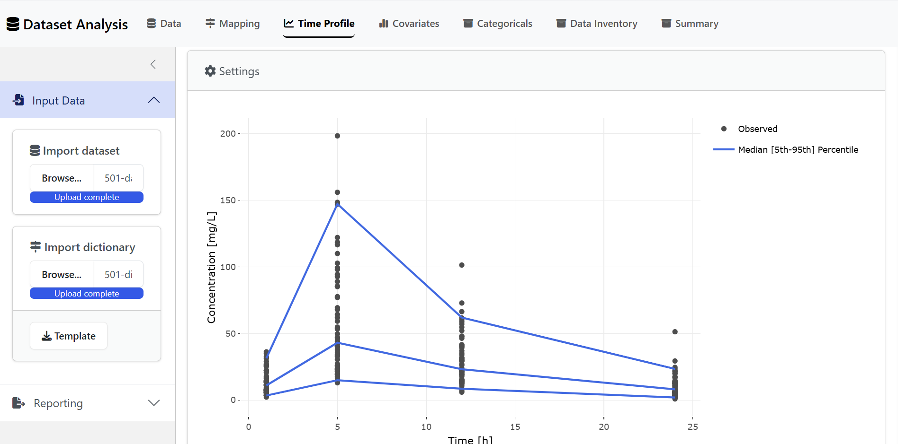
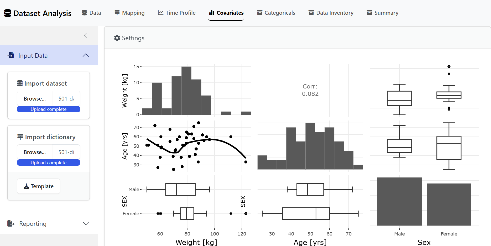
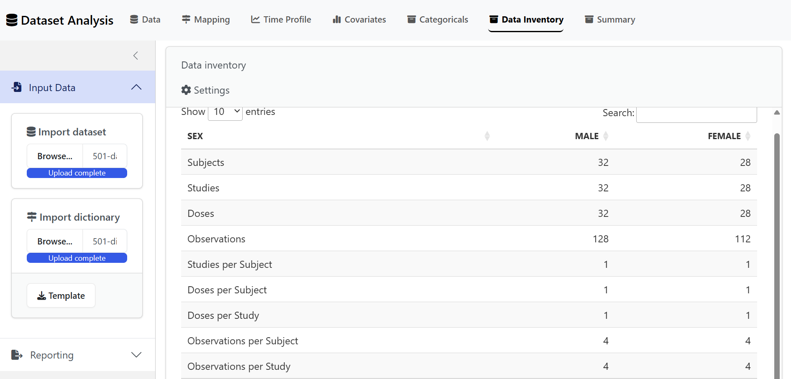

# Shiny Apps

The `{nonmem.utils}` package includes a series of Shiny Apps to
interactively perform your Nonmem related analyses.

## Shiny Toolbox

Use the code below or the Addins drop-down menu to check all available
analyses:

``` r

nonmem.utils::shiny_toolbox()
```

📷 View snapshot



## Dataset Analysis

``` r

nonmem.utils::run_shiny("dataset-analysis")
```

📷 View snapshots

| 🚀 Data                     | 📈 Time Profile             |
|-----------------------------|-----------------------------|
|  |  |
| 💼 Covariates               | 💼 Data Inventory           |
|  |  |
