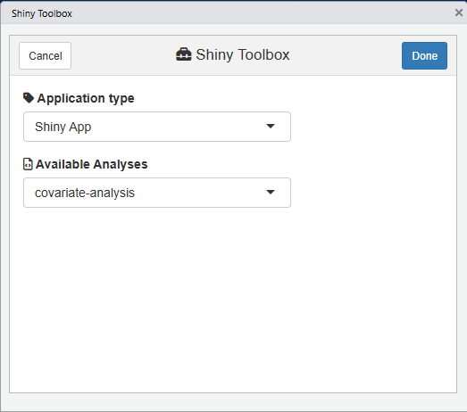
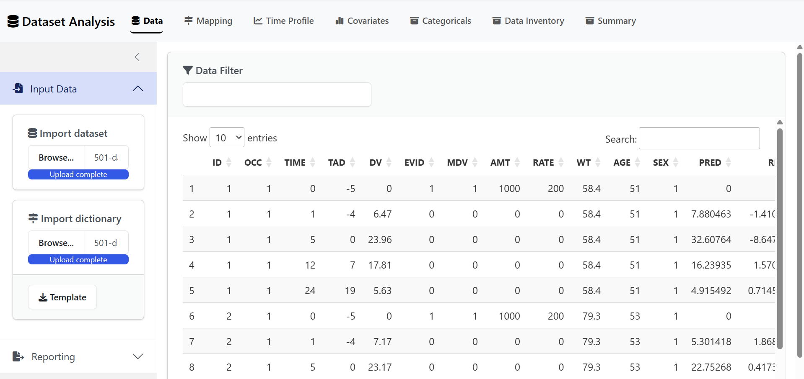
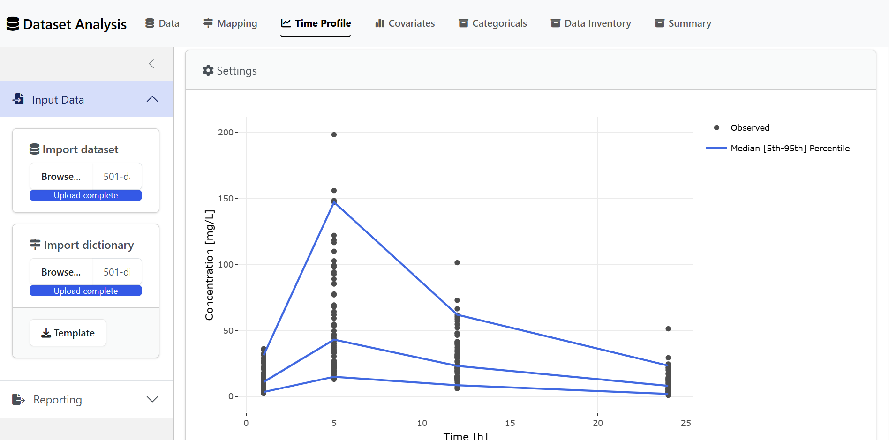

```{r, include = FALSE}
knitr::opts_chunk$set(
  collapse = TRUE,
  comment = "#>"
)
```

The `{nonmem.utils}` package includes a series of Shiny Apps to interactively perform your Nonmem related analyses.

## Shiny Toolbox

Use the code below or the Addins drop-down menu to check all available analyses:

```r
nonmem.utils::shiny_toolbox()
```

<details><summary>&#128247; View snapshot</summary>

</details>

## Dataset Analysis

```r
nonmem.utils::run_shiny("dataset-analysis")
```

<details><summary>&#128247; View snapshots</summary>
<table>
  <tr>
    <th>&#128640; Data</th>
    <th> &#x1F4C8; Time Profile</th>
  </tr>
  <tr>
    <td></td>
    <td></td>
  </tr>
  <tr>
    <th>&#128188; Covariates</th>
    <th>&#128188; Data Inventory</th>
  </tr>
  <tr>
    <td></td>
    <td></td>
  </tr>
</table>
</details>
